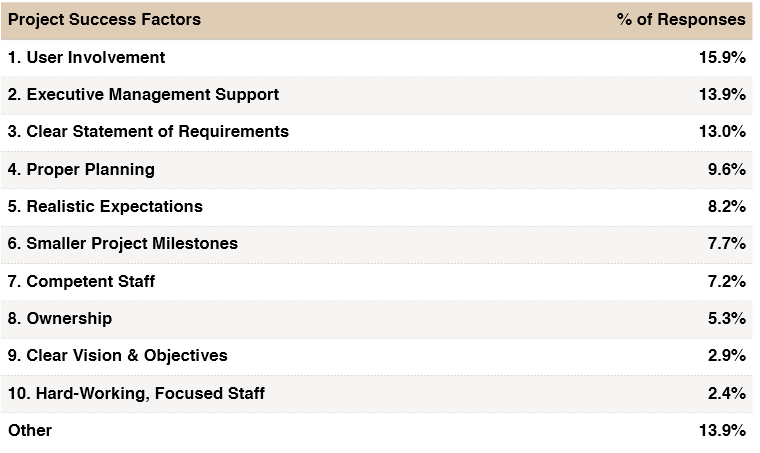

# Communiquer
<!-- _header: Truc -->
---

## Questions interactives

[https://www.mentimeter.com/app/presentation/alcqovs3shvxmikjjmnth22vxfe8n23k/edit?question=g7krjfh7ydrk&seriesId=alcqovs3shvxmikjjmnth22vxfe8n23k](https://www.mentimeter.com/app/presentation/alcqovs3shvxmikjjmnth22vxfe8n23k/edit?question=g7krjfh7ydrk&seriesId=alcqovs3shvxmikjjmnth22vxfe8n23k)

---

## Intro

### Quelques chiffres - prjets informatiques

- **31,1%** sont **stoppés** en cours de route et ne sont donc jamais déployés.

- **52,7%** des projets **dépassent** de 189% leurs prévisions budgétaires.

---

## Motifs d'échecs

---

- Participation des utilisateurs
- Soutien de la direction
- Énoncé clair des besoins

--- 

### Pour moi:

- Mauvaises spécifications métiers (client)
- Code de mauvaise qualité
- Problèmes de communication

---

## Communiquer - Objectifs

1. Réduction des tensions et gestion des conflits
2. Amélioration de la collaboration et du travail d'équipe
3. Renforcement de la clarté et de l'efficacité des échanges
4. Gestion du stress et des émotions dans les interactions professionnelles

---

## Les types de débats

- Avez-vous déjà eu des discussions avec 2 points de vue différents? Est-ce qu'à la fin de la discussion, une des personnes a réussi à convaincre l'autre ?

---

## Reconnaître les 2 types de débats

- Quels sont les différences entre ces questions:
    - La terre est-elle plate ou sphérique?
    - Qu'est-ce qui a meilleur goût: les endives ou les tomates?
    - Vaut-il mieux voter à gauche ou à droite?
    - Le vaccin x est-il efficace ?
    - Le vaccin x est-il dangereux ?
    - L'homme a-t-il mis le pied sur la lune ?
    - Java est-il mieux que JavaScript ?

---

## Faits vs Opinions

Lorsqu'on discute d'un sujet, il est essentiel de distinguer si l'on débat sur des opinions ou sur des faits. Cette distinction influence la manière dont on argumente et la possibilité d'arriver à un consensus.

---

## Qu'est-ce qu'un fait ?

Un fait est une information objective, vérifiable et indépendante des croyances personnelles. Il peut être prouvé par des observations, des expériences ou des données.

🔹 **Exemples de faits** :

- L'eau bout à 100°C sous une pression atmosphérique normale.
- La France a remporté la Coupe du Monde de football en 1998.
- Paris est la capitale de la France.

---

## Comment vérifier un fait ?

On peut se baser sur des sources fiables, comme des études scientifiques, des documents officiels ou des statistiques.

---

## Qu'est-ce qu'une opinion ?

Une opinion est une idée ou un jugement personnel, subjectif, qui peut varier selon les individus. Elle repose sur des croyances, des valeurs ou des goûts.

🔹 **Exemples d'opinions** :

- "Le chocolat noir est meilleur que le chocolat au lait."
- "Paris est la plus belle ville du monde."
- "Le football est le sport le plus intéressant."

---

## Une opinion peut-elle être argumentée ?

Oui ! On peut défendre une opinion avec des arguments, mais elle ne peut pas être prouvée de manière absolue comme un fait.

---

## Conclusion

Dans ce cours, nous allons explorer les principes fondamentaux de la gestion de projet et découvrir comment les appliquer efficacement dans le contexte spécifique de l'informatique. 

Que vous aspiriez à devenir développeur, chef de projet, ou entrepreneur dans le domaine de la technologie, les compétences que vous allez acquérir ici seront inestimables.

## Les règles:

- créer 2 catégories pour ces questions.
    - avis / opinions vs fais vérifiables

REGLE 1: identifier le type de débat / discution. 

Exemple de débat:
Les emutiers sont-ils de terroristes ?
Avant de commencer: 
- Définir "émeutiers"
- Définir "terrorisme"

REGLE 2: Définir les notions / critères évoqués (efficace, dangeureux, mieux ?) Se mettre d'accord sur le sens des mots, sur la question posée

## Participer à la discution

- éviter les arguments / contre arguments sans fin
- Ecouter et creuser les arguments des autres
- Ne JAMAIS s'enerver
- Encourager la recherche de consensus et de compromis plutôt que de simplement chercher à convaincre. La polarisation n'est pas obligatoire
- Promouvoir la pratique de la reformulation des arguments des autres participants pour s'assurer de bien les comprendre.
- Rester ouvert à la remise en question de ses propres convictions et à la possibilité de changer d'avis en fonction de nouvelles informations.

## Entretien épistémique

Pourquoi les débats traditionnels échouent-ils souvent? Ils tendent à être dogmatiques, avec les participants fermés au changement et cherchant à imposer leur point de vue plutôt qu'à écouter.
– Le biais de croyance : « On aime croire vraies les idées qui nous plaisent, même si elles sont fausses. Si elle va dans le sens de ce qu'on veut croire, on va y croire. »
– Le retour de flamme : « plus on va montrer des faits à une personne qui veut croire que ses croyances sont vraies, plus elle va s'ancrer dans sa croyance et refuser de croire ce fait. »
– L'ultracrépidarianisme : « Comportement qui consiste à donner son avis sur des sujets à propos desquels on n'a pas de compétence.» L'humain confond souvent croyance et connaissance, et la conversation épistémique tente d'une certaine manière de les différencier.

L'entretien épistémique est une approche alternative. Il s'agit d'un dialogue respectueux explorant les croyances, les raisons qui les soutiennent, et les méthodes utilisées pour les établir. Plutôt que d'imposer des faits, cette méthode se concentre sur le questionnement pour semer le doute et encourager la réflexion chez l'autre.

Les principales règles de l'entretien épistémique sont de rester dans le questionnement, d'écouter attentivement sans imposer ses propres croyances, et de chercher à susciter la réflexion chez l'autre plutôt que de chercher à le convaincre immédiatement.

La victoire dans ce type de discussion ne réside pas dans le changement immédiat d'opinion, mais dans la capacité à faire réfléchir l'autre. Lorsque celui-ci admet ne pas savoir ou reste silencieux pour réfléchir, c'est une étape importante.

Pour en savoir plus sur cette approche, des ressources telles que la "Street epistemology" sur YouTube offrent des exemples concrets de son application.

## La **zététique *"l'art du doute"***

**l'étude [rationnelle](https://www.toupie.org/Dictionnaire/Rationnel.htm)** des phénomènes présentés comme **paranormaux, des [pseudosciences](https://www.toupie.org/Dictionnaire/Pseudoscience.htm) et des thérapies étranges**

La zététique ne s'intéresse qu'aux théories scientifiquement réfutables. De ce fait, contrairement aux autres mouvements sceptiques, elle **ne pose pas la question des [religions](https://www.toupie.org/Dictionnaire/Religion.htm) et des [croyances](https://www.toupie.org/Dictionnaire/Croyance.htm) non réfutables**

Son [objectif](https://www.toupie.org/Dictionnaire/Objectif.htm) est la mise à l'épreuve d'énoncés pourvus de sens et de [nature](https://www.toupie.org/Dictionnaire/Nature.htm) scientifique, c'est-à-dire réfutables, dont les interprétations ne semblent pouvoir se rattacher à aucune théorie communément acceptée. Elle se réclame aussi du

**scepticisme scientifique**  et plus généralement d'une démarche de **doute cartésien** 

## Connaitre les biais (notre cerveau se trompe)
Ce sont les pièges internes dans notre manière de penser, des erreurs cognitives où notre cerveau nous trompe, souvent de façon inconsciente. Ces biais influencent nos jugements et décisions, souvent de manière irrationnelle.

- biais du survivant: avion puis la chute des chats
- biais d ancrage: Le biais d'ancrage ou parfois biais de point de départ **décrit notre tendance à trop nous appuyer sur la première information que nous recevons**. Lorsque nous prenons une décision, notre premier point de référence agit souvent comme une "ancre".
    - ***« 1. Une baleine mesure-t-elle plus ou moins de 49 mètres ? »* ; *
    « 2. A votre avis, combien mesure une baleine ? »* : 
    avec les questions posées dans cet ordre,
     les cobayes des [chercheurs en psychologie Fritz Strack et Thomas Mussweiler](https://www.researchgate.net/publication/232540523_Explaining_the_Enigmatic_Anchoring_Effect_Mechanisms_of_Selective_Accessibility) 
     ont répondu, en moyenne, qu'une baleine mesurait 60 mètres.
      En revanche, lorsque la seconde question était posée seule,
       la moyenne des réponses tombait à 30 mètres.**

- biais de confirmation
    - Le biais de confirmation d'hypothèse (ou biais de confirmation) est
     la **tendance naturelle qu'ont les êtres humains à privilégier les informations qui confortent leurs préjugés, leurs idées reçues, leurs convictions, leurs hypothèses**.
    
    **Le biais d'autorité**
    
    **Définition :**
    
    Le biais d'autorité est le fait de surévaluer l'opinion d'une personne que l'on
     va considérer comme ayant une autorité sur un sujet donné.
      Cela peut être les parents, médecins, scientifiques, 
      et autres spécialistes ou experts. 
      Ces personnes sont censées être expertes dans leur domaine respectif, 
      et donc leur parole est rarement remise en cause. 
      Ce biais va prendre leur opinion comme référence, 
      de ne pas la contredire même si parfois on a des doutes,
       ou encore de suivre leurs recommandations.
    
    **Exemple :**
    
    La très célèbre expérience sur l'obéissance à l'autorité en
     1961 par Stanley Milgram illustre bien ce biais.
    
- effet Dunning-Kruger
    - les experts, ceux qui maîtrisent totalement leur sujet, ont parfois l'impression et le ressenti de ne rien connaître à ce sujet.
    - et a contrario, ceux qui n'y connaissent rien fanfaronnent sans fin sur des sujets, finalement, qu'il ne maîtrisent pas.
    
    L'effet Dunning-Kruger, aussi **appelé l'effet de surconfiance**, est un biais cognitif selon lequel les moins qualifiés dans un domaine surestiment leurs compétences.
    
    Cet effet a été démontré par une série d'expériences qui ont été menées par des psychologues américains, David Dunning et Justin Kruger.
    
    

- Biais de disponibilité : Juger la probabilité d'un événement en fonction de la facilité avec laquelle on peut se souvenir d'exemples de cet événement.
    Imaginons qu'une personne regarde les actualités et voit plusieurs reportages sur des accidents d'avion très médiatisés au cours du mois. Après cela, elle commence à penser que voyager en avion est dangereux et évite de prendre l'avion pour ses prochains voyages.
    Explication :
    Dans ce cas, la personne juge la probabilité d'un accident d'avion en fonction de la facilité avec laquelle elle se souvient des exemples récents de tels accidents, qui sont très médiatisés. Cependant, les accidents d'avion sont extrêmement rares et statistiquement moins probables que d'autres formes de transport, mais l'impression qu'elle a est déformée par la visibilité de ces événements dans les médias. C'est ce qu'on appelle le biais de disponibilité.

## Sophisme (piège qu'on nous fait)
Argument qui, partant de prémisses vraies, ou jugées telles, aboutit à une conclusion absurde et difficile à réfuter**. 2. Raisonnement vicié à la base reposant sur un jeu de mots, un argument séduisant mais faux, destiné à induire l'interlocuteur en erreur.
Ce sont les pièges externes que l'autre peut nous poser dans une conversation ou un argumentaire. Ce sont des raisonnements erronés ou trompeurs, souvent utilisés délibérément pour manipuler ou influencer.

- L'**inversion de la charge de la preuve:** à avancer un fait en incombant la [charge de la preuve](https://fr.wikipedia.org/wiki/Charge_de_la_preuve_(philosophie)) de son contraire à son interlocuteur.
    - Prouvez-moi que la [télépathie](https://fr.wikipedia.org/wiki/Télépathie) n'existe pas, ou alors c'est qu'elle existe.
    - Prouvez-moi que les [extraterrestres](https://fr.wikipedia.org/wiki/Vie_extraterrestre) n'existent pas, ou alors c'est qu'ils existent.
    
- **L'appel à la popularité**‍
    
    Ce sophisme consiste à valider une idée en arguant du fait qu'elle est admise comme vraie par un grand nombre de personnes. Cela contribue à mobiliser l'attrait du bon sens commun. En gros "*si tout le monde pense ça, alors vrai*".
    
- **La généralisation hâtive**
    
    Ce sophisme consiste à généraliser à partir d'un échantillonnage trop restreint, voire d'un simple exemple personnel. C'est bien d'illustrer un argument avec un exemple personnel, mais l'exemple seul n'est pas un argument
    
- Appel à l'émotion : Manipuler les émotions plutôt que de présenter un raisonnement logique.
    "Regardez ces enfants affamés, que ressentez-vous en les voyant ? Donnez maintenant pour sauver ces vies !"
- Fausse dichotomie : Présenter deux options comme si elles étaient les seules possibles, alors qu'il y en a d'autres.
    "Soit vous êtes pour nous, soit vous êtes contre nous. Il n'y a pas d'autres options."
- Argument ad hominem : Attaquer la personne plutôt que de discuter de l'argument qu'elle présente.
    "Tu n'es même pas un scientifique, alors pourquoi devrais-je t'écouter ? Tu n'as aucune idée de ce dont tu parles."

- **La pente glissante**

Ce sophisme consiste à présenter une série de conséquences catastrophiques sans démontrer de lien de cause à effet convaincant ou en exagérant à outrance.

"Si nous acceptons le paquet de cigarettes neutres. Dans 6 mois on vous proposera la bouteille de vin neutre. Et s'en sera fini de nos appellations, de nos terroirs, de nos savoirs-faire"

- **L'[épouvantail rhétorique](https://fr.wikipedia.org/wiki/%C3%89pouvantail_(rh%C3%A9torique)), *strawman* ou homme de paille, ou caricature**

Il s'agit de déformer l'argumentation d'un opposant pour en faire un argument plus facilement réfutable et éventuellement préparer le terrain à un sophisme de déshonneur par association.

Par exemple : « Vous ne voulez pas mettre au point ce programme de construction de porte-avions, je ne comprends pas pourquoi vous voulez laisser notre pays sans défense. »

- Mille-feuille argumentatif 

Couramment utilisé pour légitimer les théories du complot, il s'agit d'enchaîner un grand nombre d'arguments, même de faible valeur individuellement, mais qui donnent ensemble une impression de solidité et de massivité de la thèse soutenue. En ce qui concerne les extraterrestres, cette technique rhétorique peut donner ainsi : « Et les *crop circles* ? Et les nombreux témoignages ? Et les statues d'astronefs précolombiennes ? Et la perfection des pyramides ? Vraiment, les extraterrestres nous rendent visite depuis longtemps. »

Exercice : l'homme n'est jamais allé sur la lune: comment discuter avec quelqu'un qui pense ça.

- quel argument est pour toi le plus important (sortir du mille feuille pour isoler les agruments important)
- si on te démontre que cette preuve est fausse est ce que tu changes d avis ?
- que faudrait il comme preuve pour que tu change d avis ?

- [Refus de la corrélation](https://fr.wikipedia.org/wiki/Refus_de_la_corr%C3%A9lation) (une [corrélation](https://fr.wikipedia.org/wiki/Corr%C3%A9lation_(science_cognitive)) n'implique pas nécessairement une [causalité](https://fr.wikipedia.org/wiki/Causalit%C3%A9))

Les gens qui mangent des glaces ont plus de cancers.

- [**Argument circulaire ou raisonnement circulaire**](https://fr.wikipedia.org/wiki/Raisonnement_circulaire)

Il s'agit de répéter comme prémisse la conclusion qu'on tente de défendre ("Dieu existe car le livre Saint le dit ; le livre Saint dit vrai car c'est Dieu qui l'a écrit").

- rasoir d'Ockham

Egalement connu sous le nom de la "loi de parcimonie" ou "principe de simplicité", est une règle heuristique qui stipule que parmi plusieurs explications possibles d'un phénomène, la plus simple est généralement la meilleure. Ce principe est largement utilisé dans de nombreux domaines, notamment en philosophie, en sciences, en statistiques, et même en informatique.

La meilleure explication est celle qui fait intervenir le plus petit
nombre d'hypothèses ad hoc, c'est-à-dire hypothèses non
documentées.
« Il vaut mieux prendre des principes moins nombreux et de
nombre limité. » Aristote, La Physique, vers 340

exemple du chat et du poisson rouge

- Le « rasoir d'Alder »

On peut le résumer tel que « ce qui ne peut être établi par l'[expérience ou l'observation](https://www.wikidata.fr-fr.nina.az/R%C3%A9futabilit%C3%A9.html), ne mérite pas de débat ».

- Le **rasoir de Hanlon**

R[ègle de raisonnement](https://fr.wikipedia.org/wiki/Rasoir_(philosophie)) permettant d'éliminer des [hypothèses](https://fr.wikipedia.org/wiki/Hypoth%C3%A8se). Formulée en 1980 par le [programmeur](https://fr.wikipedia.org/wiki/D%C3%A9veloppeur) américain Robert J. Hanlon, cette règle s'énonce de la manière suivante : « Ne jamais attribuer à la malveillance ce que la bêtise suffit à expliquer. »

Malentendu dans un e-mail : Si vous recevez un e-mail qui vous semble offensant ou maladroit, au lieu de supposer que l'expéditeur a l'intention de vous nuire, appliquez le **rasoir de Hanlon** et envisagez qu'il puisse s'agir d'un malentendu ou d'une communication maladroite.

## **Sophismes à éviter :**

- L'attaque ad hominem : critiquer la personne plutôt que ses arguments.
- La fausse dichotomie : présenter une situation comme ayant seulement deux options possibles alors qu'il en existe d'autres.
    - En polotique « Êtes-vous avec nous ou avec les [terroristes](https://fr.wikipedia.org/wiki/Terroriste) ? » « Allez-vous voter pour moi, ou allez-vous laisser le chômage augmenter indéfiniment ? » « Quelle alternative proposez-vous au [capitalisme](https://fr.wikipedia.org/wiki/Capitalisme) ? Vous voulez instaurer un système soviétique ! »
    - 'affirmations [manichéennes](https://fr.wikipedia.org/wiki/Manich%C3%A9isme_(attitude)) : « Si vous n'êtes pas de gauche, vous êtes forcément de droite »
    - Les parents qui s'adressent à leur enfant peuvent faire une utilisation du faux dilemme : « Soit tu vas à l'[université](https://fr.wikipedia.org/wiki/Universit%C3%A9), soit tu seras balayeur ou manœuvre toute ta vie ! »
- L'appel à l'ignorance : affirmer qu'une assertion est vraie parce qu'elle n'a pas été prouvée fausse, ou vice versa. "• Dieu n'existe pas parce que vous ne pouvez pas prouver que Dieu existe (ou inversement)."
- La déformation des faits : présenter des informations de manière sélective ou trompeuse pour soutenir un argument.

Attention aux intuitions / bon sens / :

exemple du ruban autour de la terre

Soit une ficelle qui fait le tour de la Terre au niveau de l'Equateur (40.000 km environ). En estimant que la Terre est parfaitement ronde, si vous rajoutez 6,28 mètres a cette ficelle, elle sera alors à un mètre du sol. Mais si vous mettez une autre ficelle autour d'une balle de ping-pong, il faudra également rajouter 6,28 mètres à la ficelle pour qu'elle soit à 1 mètre de la balle.

En effet, le rayon de la sphère prise en compte (que ce soit une bille, une pastèque ou Jupiter) n'entre pas en compte.Voici l'explication mathématique : une ficelle, pour faire le tour d'une sphère de rayon R, doit mesurer 2*R*[Pi.Si](http://pi.si/) on veut mettre cette ficelle à un mètre du sol, elle doit faire 2*(R + 1)*Pi.On doit donc la rallonger de 2*(R + 1)*Pi - (2*R*Pi) soit 2Pi, ce qui fait environ 6,28 et ne change jamais quel que soit le rayon de la sphère.

Le morceau de bois, le marbre et le glaçon.

Identifier les techniques:

[https://www.youtube.com/watch?v=un_LKKIYH4w&ab_channel=CordialCuriosity](https://www.youtube.com/watch?v=un_LKKIYH4w&ab_channel=CordialCuriosity)