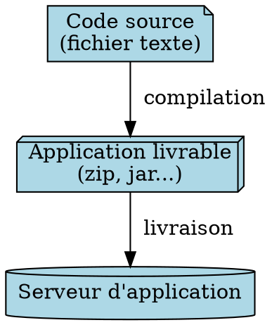

# Sommaire

1) Familles d'applications
2) Construire une application
3) Le Socle

---
# Familles d'applications

* Suite cocktail: scolarix, scolpeda, agrhum...
* Editeurs tiers: jira, confluence, moodle...
* Applications unc hors socle: reva, DOM, ipweb...
* Applications unc socle: tgw, importsup, dematia, toolbox, backoffice ipweb...

---

# technologies

Historiquement, les applications ont été développées de façon indépendantes avec des technologies hétérogènes

* difficultées de maintenances
* difficultées à faire évoluer
* difficultées pour récruter 
* Difficultées de réutilisation

----

* Cocktail 
	Préinscriptions RDVweb
	Scolarix ScolPédagogie IP Web
	G-Spot Superplan GroupeScol
	EdtWEB Hcomp Mangue
	Hamac Annuaire Web Agrhum
	DOM Kiwi Carambole
	Bibasse Maracuja JefyAdmin
	Situations Cocoligth Corossol
	...

* Le Socle 
	TGW Toolbox
	webinscription Progressions
	Importsup 
	BackOffice-IpWeb
	Dematia Moodle Admin
	SiseWeb 
	Dossier Etudiant
	...

* Tiers
	Jira
	Confluence
	...

---
Le nouveau socle:

- homogène: même language, même process de livraison, même documentation etc.. pour tous les nouveaux projets
- réutilisable: composant d'authentification, les menus, la charte graphique
- automatisation maximum: moins d'erreurs humaines

----

# Le socle
## 3 environnements

- dev : pour la dsi
- test: pour les utilisateurs
- prod: production

----

## Connexion avec votre compte unc

----

## Le template des nouvelles applications

----

## Comment on fait un programme ?

----

## L'usine l'ogicielle

Le but de l'usine logicielle est d'automatiser la compilation, les tests et la livraison.

----

## Démo

----

## Avis / questions

