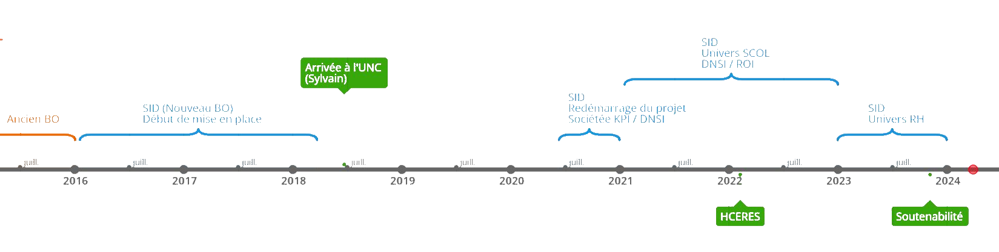
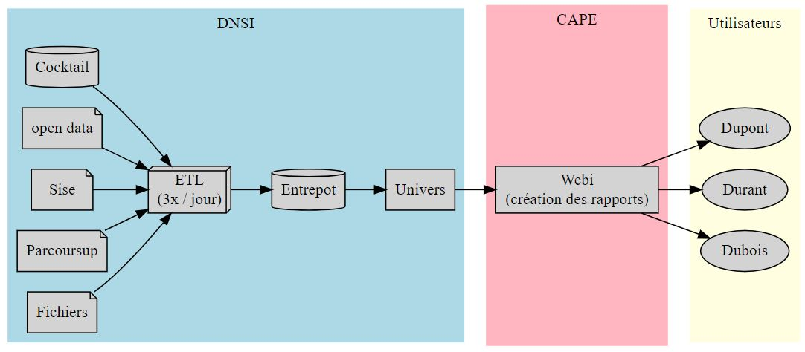

# Objectifs

---

# Objectifs
#### 'Be the idiot in the room' - Simon Sinek

* Parler la même langue: SID, BO, décisionnel, univers...
* Avoir une vue d'ensemble: Qui fait quoi?
* Maturité de l'architecture technique
* Solutions alternatives: sterennes, sirocco

---

# Historique

https://time.graphics/line/818941

---
# Définitions
* **BI**: Business Intelligence, désigne l'ensemble des technologies, des outils et des pratiques utilisés pour collecter, intégrer, analyser et présenter des informations commerciales ou stratégiques

* **BO**: Business Objects, solution de BI édité par la société allemande SAP AG (outil utilisé à l'UNC). Concurrents : Cognos (développé par IBM), Microsoft Power BI.

* **Entrepot de donnée - DataWareHouse**: Une base de données centralisée et intégrée qui stocke des données provenant de diverses sources dans une **structure optimisée** (star schéma) pour l'analyse et la génération de rapports

* **ETL**: Extract, transform, and load. Processus (ensemble de programmes) utilisé pour extraire des données de différentes sources, les transformer, puis les charger dans un entrepôt de données

---
# Définitions
* **Fait - Univers**: Une couche d'abstraction logique qui permet aux utilisateurs de BI d'accéder et d'interagir avec les données de manière simplifiée et cohérente.

* **Designer**: Outil de construction des univers

* **Webi**: Outil de création des rapports

* **Cmc**: Outil d'administration (utilisateur, droits etc...)

---
# Définitions
* **Launchpad**: Point d'entrée des utilisateurs (site web) pour consulter les rapports BO

* **SID**: système d'information décisionnel - Ensemble des moyens, outils et méthodes qui permettent à l’entreprise de **collecter**, **transformer**(renforcer, stocker, agréger) et **restituer** les **données importantes** afin de fournir une **aide à la décision**.

---

# Graph

---
# Maturité de l'architecture technique

## Fonctionnalités techniques
* ✔ Intégration à gitlab (usine logicielle)
* ✔ BDD cocktail
* ✔ BDD Postgres (moodle par exemple)
* ✔ Fichiers trés volumineux ('toutes universités')
* ✔ Parcoursup
* ✔ Sise
* ✔ Open data (data.enseignementsup-recherche.gouv.fr)
* ✔ Mise à jour de la plateforme (2023)
* ✔ Création de la nouvelle plateforme 4.3 (en cours)

---
# Maturité de l'architecture technique

## Mise à jour de la plateforme

* ████████████████████████████████▓ 99%

---
# Sterennes et Sirocco

## ⚠ Disclaimer
* Ne sont pas des solutions clefs en main
* Fournissent l'ETL et l'entrepot (en partie)
* Notre solution ETL est meilleure
	- plus rapide
	- plus facile à maintenir
	- plus adaptée à nos besoins
	- intégrée à notre usine logicielle

---
# Sterennes et Sirocco
## Sirocco (9 universités)
* 28/09/2023 - présentation projet SIROCCO - Lyon 3
* 10 ans d'expérience
* Organisation: un informaticien intégré à 'CAPE'
* Le connecteur cocktail est (peut-être) en cours de développement
* 2 modes de fonctionnements:
	- Gratuit: participer au projet (1/2 ETP)
	- Payer
* Un fonctionnement similaire au notre (création de requetes à la demande puis intégration au SID)

--- 
# Sterennes et Sirocco
## 	Sterennes (21 universités)
* 10 novembre 2023 - SID dédié à la communauté COCKTAIL
* Présentation trés 'commerciale' (pas d'échange)
* Disponible ici: https://sterennes.univ-rennes.fr/videos-webinaires

---
# Sterennes et Sirocco
## Conclusion
* Manque de vision sur ce que proposent ces solutions
* Manque de vision sur la mise en place et l'utilisation
* Nécessiterai des échanges (technique et métier) avec les universités clientes

---
# Merci!
#### 'There are no wrong decisions. There are only right decisions and lessons learned'
 
 
 