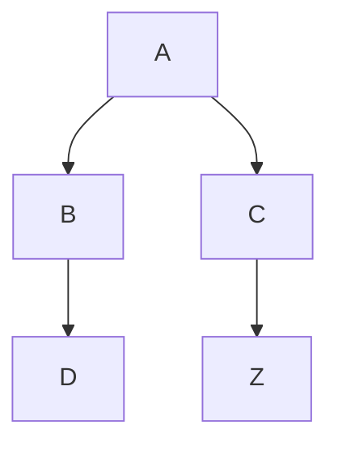

<!-- Script pour initialiser Mermaid -->

graph TD;
    Démarrage-->Arrêt;
    Démarrage-->Pause;
    Pause-->Arrêt;

```mermaid
graph TD;
  A-->B;
  A-->C;
  B-->D;
  C-->Z;
```

graph TD;
    A-->B;
    A-->C;
    B-->D;
    C-->D;

